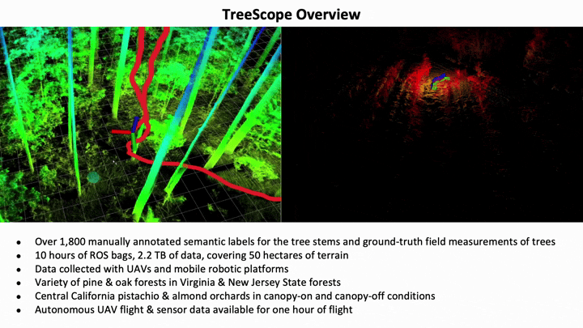

# 🌲 TreeScope: An Agricultural Robotics Dataset for LiDAR-Based Mapping of Trees in Forests and Orchards
<!--  -->

## Overview

[](https://www.youtube.com/watch?v=750oL-VsSIM)

**TreeScope** is a robotics dataset for precision agriculture and forestry addressing the counting and mapping of trees in forestry and orchards. **TreeScope** provides LiDAR data from agricultural environments collected with robotics platforms, such as UAV and mobile robot platforms carried by vehicles and human operators. We provide ground-truth data for semantic segmentation and diameter estimation with over 1,800 manually annotated semantic labels for tree stems and field-measured tree diameters. We share benchmark scripts for these tasks that researchers may use to evaluate the accuracy of their algorithms.

**TreeScope** processed data, raw data, and code are available to [download](https://test.treescope.org). 
For more information about our dataset, please visit [https://treescope.org](https://treescope.org/) or watch our [video](https://youtu.be/GgV1PmLEFeI).

## Converting Labels

For converting H5 labels into 2D range images:
```
python3 semantic_labels/h5-to-labels.py --file <path-to-h5>
```

For labeled 2D range images into H5 labels:
```
python3 semantic_labels/full_data_preprocessor.py -D <path-to-data>
python3 semantic_labels/labels-to-h5.py --data <path-to-data>
```

## Diameter Estimation Benchmarks

For calculating root-mean-square error of diameter estimation results compared to ground-truth:
```
python3 diameter_estimation/evaluate_dbh_rmse.py --dataset <dataset-name> --predictions <predictions-yaml>
```

## Semantic Segmentation Benchmarks

For calculating IoU of inference point cloud (projected to 2D range image) compared to ground-truth:
```
python3 semantic_segmentation/evaluate_iou.py --dataset <dataset-name> --predictions <predictions-yaml>
```

# Citation
You can access the paper from [arXiv](https://arxiv.org/abs/2310.02162). To
cite our work, please use:
```
@misc{cheng2023treescope,
  title={TreeScope: An Agricultural Robotics Dataset for LiDAR-Based Mapping of Trees in Forests and Orchards}, 
  author={Derek Cheng and Fernando Cladera Ojeda and Ankit Prabhu and Xu Liu and Alan Zhu and Patrick Corey Green and Reza Ehsani and Pratik Chaudhari and Vijay Kumar},
  year={2023},
  eprint={2310.02162},
  archivePrefix={arXiv},
  primaryClass={cs.RO}
}
```

## Contributions or Questions?

Please [fill-out an issue](https://github.com/KumarRobotics/treescope/issues) if you have any questions.
Do not hesitate to [send your pull request](https://github.com/KumarRobotics/treescope/pulls).